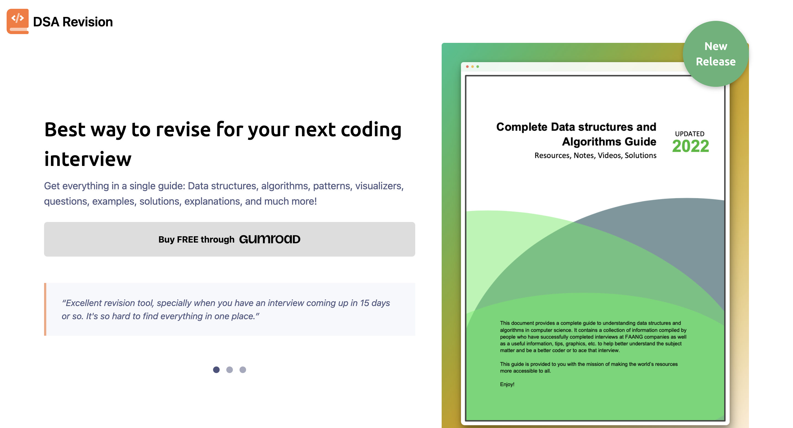
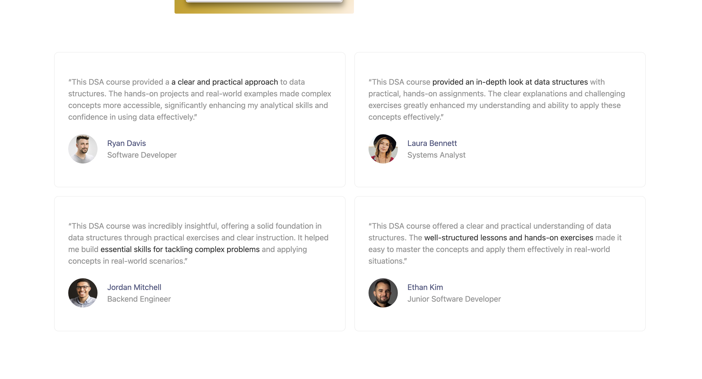

# DSA Course Page

## Table of contents

- [Overview](#overview)
- [Features](#features)
- [Screenshots](#screenshots)
- [Live Site](#live-site)
- [Technology Used](#technology-used)

## Overview

This project is a comprehensive guide for revising data structures and algorithms (DSA) in preparation for coding interviews. The website showcases the guide's features, including various resources, explanations, and practical exercises. Designed with Tailwind CSS, the site emphasizes a modern and responsive design.

## Features

- **Comprehensive Coverage:** Includes data structures, algorithms, patterns, visualizers, questions, examples, solutions, and explanations.
- **Interactive UI:** Dynamic elements such as review switches and a new release badge.
- **Responsive Design:** Built using Tailwind CSS for a clean and responsive user experience.
- **Real-world Examples:** Practical exercises and real-world examples to aid understanding.

## Screenshots

*Homepage showing the main features and call-to-action.*

*Reviews section displaying user feedback.*

## Live Site

You can view the live site [here](https://dsa-course.netlify.app).

## Technology Used

- **HTML/CSS:** For the basic structure and styling of the website.
- **Tailwind CSS:** Used for responsive and modern design.
- **JavaScript:** For interactive features and dynamic content.
## Acknowledgements

 - [Awesome Readme Templates](https://awesomeopensource.com/project/elangosundar/awesome-README-templates)
 - [Awesome README](https://github.com/matiassingers/awesome-readme)
 - [How to write a Good readme](https://bulldogjob.com/news/449-how-to-write-a-good-readme-for-your-github-project)

